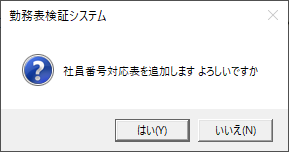

# 勤務表検証システム

VerifyAttendanceCSV

## 1. 目次

- [1. 目次](#1-目次)
- [2. 勤務表検証システムについて](#2-勤務表検証システムについて)
  - [2.1. 業務フロー](#21-業務フロー)
- [3. CSV照合](#3-csv照合)
  - [3.1. 前提条件](#31-前提条件)
  - [3.2. 操作方法](#32-操作方法)
- [4. 社員番号登録](#4-社員番号登録)
  - [4.1. 前提条件](#41-前提条件)
  - [4.2. 操作方法](#42-操作方法)
- [5. カレンダー登録](#5-カレンダー登録)
  - [5.1. 前提条件](#51-前提条件)
  - [5.2. 操作方法](#52-操作方法)
  - [5.3. 更新の範囲](#53-更新の範囲)
- [6. 技術情報](#6-技術情報)

## 2. 勤務表検証システムについて

### 2.1. 業務フロー

勤務表検証システムは、工数記録システムで記録した勤務表と、勤怠システムのCSVファイルを照合することを目的としている。
そのため、工数記録システムと当システムの仕様は相互に関わり合っている。

## 3. CSV照合

### 3.1. 前提条件

- 勤怠システムからCSVファイルを出力しておく。
- 勤務表エクセルを提出フォルダにあることを確認する。

### 3.2. 操作方法

1. アプリケーションを起動する。 
   
1. 勤怠CSVファイルをドラッグ＆ドロップする。 
   
1. 勤務表エクセルがあるフォルダをドラッグ＆ドロップする。
   - 通常は前回使用した値が保存されているので、内容を確認する。
   - 必要なら、フォルダをドラッグ＆ドロップする。
   - 不要な項目があれば、右クリックで削除する。
1. 処理対象月を選択する。
   - 初期表示は前月になっているので、必要があれば変更する。
1. 自社休日カレンダー最終日付を確認する。
   - 休日カレンダーの登録が無い月は検証できないので、検証前に登録する必要がある。
1. 「進む」ボタンをクリックする。
   - 照合を開始する。これには5分程度の時間を要する。
1. 結果を確認する。 
   
   - 項目を確認して、該当者またはその上司に連絡して修正を依頼する。
1. 勤務表エクセルをアーカイブする。
   - 今回は印刷して補完することにした。
   - 印刷機能は、別マクロで実行する。

## 4. 社員番号登録

勤怠システムのCSVファイル内の社員番号は、勤怠システム独自の社員番号が割り振られている。この番号を受注管理の社員番号にするための対応表を登録する。

### 4.1. 前提条件

1. 「N:\04共通\開発・設計受渡し\勤務表検証システム」フォルダから、「社員番号対応表_テンプレート.xlsx」を開く。 
   
2. 「社員番号」の列に、受注管理の社員番号、「勤怠個人コード」の列に、勤怠システムの社員番号を入力する。

### 4.2. 操作方法

1. アプリケーションを起動する。
2. 「社員番号登録」ボタンをクリックする。 
   
3. 「社員番号対応表_テンプレート.xlsx」をドラッグ＆ドロップする。 
   
4. 「登録」ボタンをクリックする。
   - 確認メッセージの「はい」ボタンをクリックする。 
      
5. 終了メッセージが表示される。 
   

## 5. カレンダー登録

休日の判定をするためにカレンダーを登録する。
カレンダーは事業所ごとに複数持つことができ、現在は、本社と松阪の2つ登録することができる。
また、工数記録システムでも、ここで登録したカレンダーを使用することから、社員が工数記録する月より前に登録しておく必要HolidayCalendarTemplateある。

### 5.1. 前提条件

1. 「N:\04共通\開発・設計受渡し\勤務表検証システム」フォルダから、「休日カレンダー_テンプレート.xlsx」を開く。 
   
2. 「休日」の列に休みの日付、その日付が法定休日の場合は、「法定休日の場合は１」列に ”1” を入力する。

### 5.2. 操作方法

1. アプリケーションを起動する。
2. 「カレンダー登録」ボタンをクリックする。 
   
   - 事業所ごとの休日カレンダー最終日付を見て、必要な事業所のカレンダーを登録する。
3. 「休日カレンダー_テンプレート.xlsx」をドラッグ＆ドロップする。 
   
4. 事業所のラジオボタンをクリックする。
5. 「登録」ボタンをクリックする。
   - 確認メッセージの「はい」ボタンをクリックする。 
      
6. 終了メッセージが表示される。 
   

### 5.3. 更新の範囲

テンプレートのエクセルで指定された日付の範囲を上書きするのであるが、注意点がある。

ルールを整理すると

- テンプレートの最小(最過去)日の1日から最大(最未来)日の末日の範囲を消す。
- テンプレートの内容で書き換える。

この様な処理が行われている。
たとえば、テンプレートに、「2023/6/15」の1行指定があるときは、「2023/6/1」から「2023/6/30」の範囲の既存情報を削除して、1項目データを追加する。

ここから、最も注意すべきは6月と9月を追加しようと考えた場合である。
テンプレート中に、6月と9月の情報を記載して登録しようとすると、「2023/6/1」から「2023/9/30」の範囲の既存情報を削除されてしまう。この中には、**7月・8月も削除範囲に含まれて**いて、意図した状況と違う結果になる恐れがある。

そのため、連続しない月の登録をしようとする場合、複数回に分ける必要がある。

## 6. 技術情報

